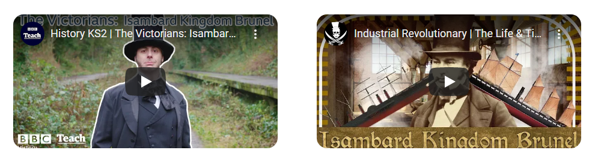
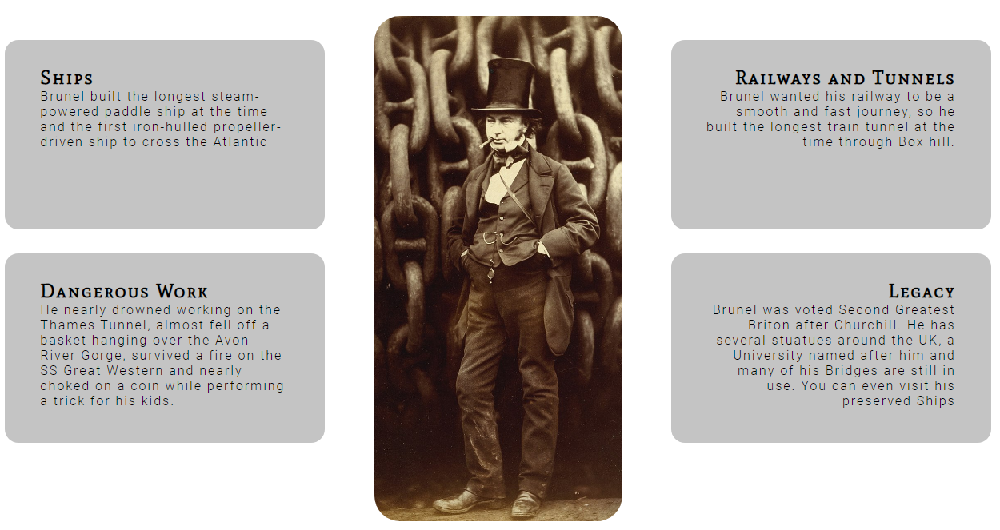

# History of Brunel

This website has been created in order to provide information on the life and impact of Isambard Kingdom Brunel for those studying history or engineering or simply interested in British historical figures. It provides facts about Brunel's acheivements and legacy as well as a timeline of his life 1806-1859.

## Features
* Navigation Bar
    * Featured in the header of all pages
    * Includes Top Hat logo inspired by Brunel's Hat which also works as a link to the Home page
    * Takes the user to the Home, Timeline and Signup pages

* Hero Image
    * Image of one of Brunel's greatest achievements the SS Great Britain
    * Image includes text overlay to show users who this site is about with Brunel's full name and occupation

* Videos Section
    * Includes two embedded Youtube videos
    * The first video has a simple explanation of Brunel's acheivements from BBC Teach
    * The second video has a more comedic list of stories from Brunel's life from Jack Rackam

* Info and Image Section

* Social Network Links
    * Featured in the footer of all pages

