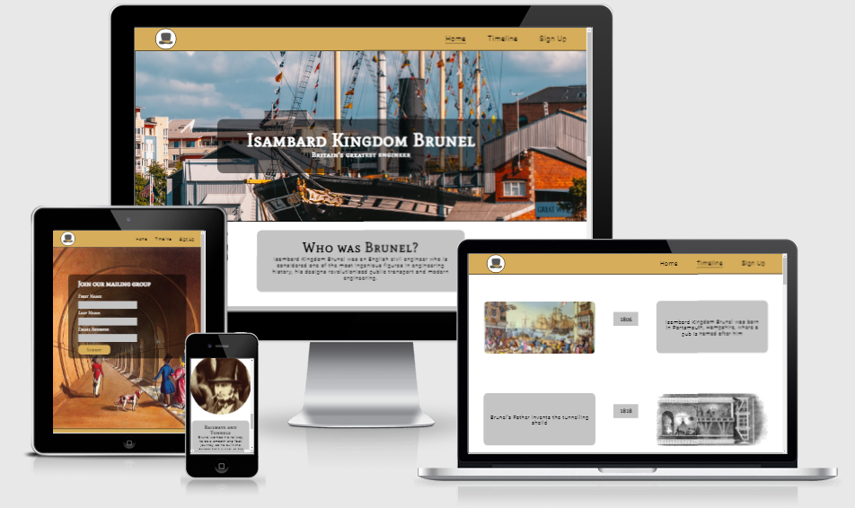
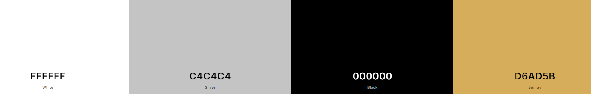

# History of Brunel

This website has been created in order to provide historical facts and information about the life and impact of Isambard Kingdom Brunel for those studying history or engineering or simply interested in British historical figures. It provides facts about Brunel's achievements and legacy as well as a timeline of his life 1806-1859.

The live site can be viewed [here](https://jordanch05.github.io/History_Of_Brunel/index.html)

## Planning

* Colour Scheme

    * Simple colour scheme chosen 
    * Contrasting dark font colours used on light background and vice versa
    * Matching header and footer colours for consistency

* Font
    * Fonts taken from [Google Fonts](https://fonts.google.com/)
    * Mate SC is used for the headings to give a more 19th Century atmosphere
    * Roboto is used for smaller texts for easier legibility since it is simplier and without serifs

* Figma
    * Pages were planned out on [Figma](https://www.figma.com) using wireframes

## Features
* Navigation Bar
    * Featured in the header of all pages
    * Includes Top Hat logo inspired by Brunel's Hat which also works as a link to the Home page
    * The logo uses the same colour scheme as the rest of the site to remain consistent
    * Easily takes the user to the Home, Timeline and Signup pages

* Hero Image
    * Landing page image of one of Brunel's greatest achievements the SS Great Britain to catch the user's attention and pique their interest 
    * Image includes text overlay to show users who this site is about with Brunel's full name and tagline to increase interest as well as show the user what this site is about

* Introduction
    * A quick introduction explaining the significance of Brunel to increase interest and giving the user reason to learn more about him

* Videos Section
    * Includes two embedded Youtube videos
    * The first video has a simple explanation of some of Brunel's achievements from BBC Teach in order to give the user a basic idea of who Brunel was
    * The second video is a more detailed video about Brunel creating the Great Western Railway and Box Tunnel, also from BBC Teach, in order to give the user a better idea of the significance of this achievment

* Info and Image Section
    * A clear layout so that the user can easily find information they are interested in
    * This section provides information on Brunel's acheivements split into four main aspects, showing the user how diverse Brunel's work was, as well as how dangerous it was
    * This section also shows the user the significance of Brunel in the modern day by showing some of his legacy
    * A photo of Brunel is displayed in the center to draw the users attention to this section and provide a clear image of the subject of this site 
    * The image becomes a smaller circular image for smaller screens so as to not take up the entire screen when this section is displayed in a vertical layout
    

* Social Network Links
    * Featured in the footer of all pages
    * Includes links to relevant social media sites for Brunel History which open in a new tab in order to make it easy to return to the site
    * This promotes the social media pages in order to keep in contact with the user for updates and Brunel related media

* Timeline
    * Provides a chronological list of all the significant moments and achievements in Brunel's life from his birth to his death
    * Includes supporting images of each event and the year they happened to give the user greater context of each event
    * This is useful to the user as it helps them identify Brunel's work and where they can be found and what they achieved
    * Images are provided for each year depicting related events
    * This timeline changes into a vertical layout for smaller screens as to provide am easier reading experience without the need to scroll sideways and prevents missed information

* Signup 
    * Allows the user to signup to a mailing list where they can be given direct updates about the website and Brunel related media
    * Especially helpful to users who do not use social media
    * It leads to a thank you message after clikcing the submit button for a positive user experience

## Features Left to Implement

* Hamburger dropdown menu would be a good addition for easier navigation on smaller screens

## Testing

### HTML

* Tested using the official [W3C Validator](https://validator.w3.org/nu/?doc=https%3A%2F%2Fjordanch05.github.io%2FHistory_Of_Brunel%2Findex.html)
* Frameborder attribute error found in the iframe elements, it is now obsolete and was removed

### CSS

* Tested using the official [Jigsaw W3C Validator](https://jigsaw.w3.org/css-validator/validator?uri=https%3A%2F%2Fjordanch05.github.io%2FHistory_Of_Brunel%2Findex.html&profile=css3svg&usermedium=all&warning=1&vextwarning=&lang=en)
* No errors found

### Browsers

* Tested on Google Chrome, Internet Explorer, Microsoft Edge and even the Samsung Internet App on Mobile and Tablet
* Tested using Google Chrome Development tools for different screen sizes
* Also opened on Honor 8X and Samsung Galaxy Tab S2

### Accessibility

* Tested using a web accessibility evaluation tool called [Wave](https://wave.webaim.org/)
* Aria-labels were added to the social media links in the footer and alt text was added for all images
* Semantic HTML is used to structure the website
* Form labels are used for the signup page

## Deployment

* This site was deployed to GitHub pages. The steps to deploy are as follows:
    * In the GitHub repository, navigate to the Settings tab
    * From the source section drop-down menu, select the Master Branch
    * Once the master branch has been selected, the page will be automatically refreshed with a detailed ribbon display to indicate the successful deployment.

The link to the live site can be found [here](https://jordanch05.github.io/History_Of_Brunel/index.html)

## Credits

### Content

* The text for the Home page was taken from the [Isambard Kingdom Brunel Wikipedia Article](https://en.wikipedia.org/wiki/Isambard_Kingdom_Brunel)
* The text for the timeline was taken from the website IKBrunel.org.uk
* The social media icons in the footer were taken from [Font Awesome](https://fontawesome.com/)
* The use of justify-content and flex display css code came from [this video](https://www.youtube.com/watch?v=b3xhm_2esTM) 

### Media

* The logo was made using [Canva](canva.com)
* The photos were taken from [Unsplash](https://unsplash.com/s/photos/brunel)
* The images were taken from IKBrunel.org.uk as well as [Wikimedia](https://commons.wikimedia.org/w/index.php?search=brunel&title=Special:MediaSearch&go=Go&type=image)
* The Youtube videos are from the channel [BBC Teach](https://www.youtube.com/channel/UC4KN50fal7f45fx2DqG7ttg)

### Other

* [W3Schools](https://www.w3schools.com/) was used for reference
* The [Code Institute](https://codeinstitute.net/) study material was heavily used
* Support from the [Slack](https://slack.com/intl/en-gb/) community did also help for solving an issue