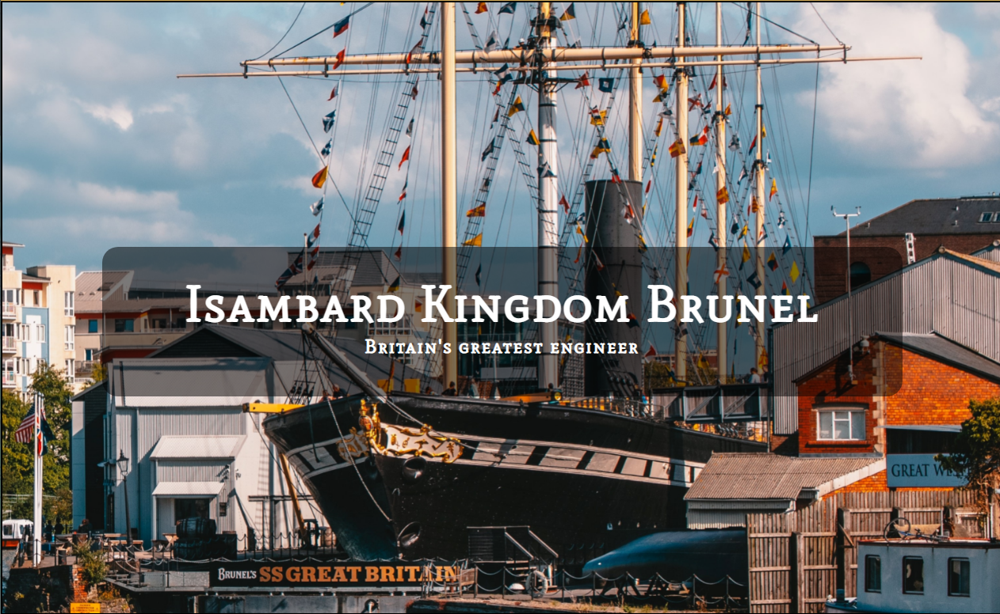

# History of Brunel

This website has been created in order to provide information on the life and impact of Isambard Kingdom Brunel for those studying history or engineering or simply interested in British historical figures. It provides facts about Brunel's acheivements and legacy as well as a timeline of his life 1806-1859.

## Features
* Navigation Bar
    * Featured in the header of all pages
    * Includes Top Hat logo inspired by Brunel's Hat which also works as a link to the Home page
    * Takes the user to the Home, Timeline and Signup pages

* Hero Image
    * Image of one of Brunel's greatest achievements the SS Great Britain
    * Image includes text overlay to show users who this site is about with Brunel's full name and occupation

* Introduction
    * A quick introduction explaining the significance of Brunel to increase interest and giving the user reason to learn more about him

* Videos Section
    * Includes two embedded Youtube videos
    * The first video has a simple explanation of some of Brunel's achievements from BBC Teach in order to give the user a basic idea of who Brunel was
    * The second video is a more detailed video about Brunel creating the Great Western Railway and Box Tunnel, also from BBC Teach, in order to give the user a better idea of the significance of this achievment

* Info and Image Section
    * This section provides information on Brunel's acheivements split into four main aspects, showing the user how diverse Brunel's work was, as well as who dangerous
    * This section also shows the user the significance of Brunel in the modern day by showing some of his legacy

* Social Network Links
    * Featured in the footer of all pages
    * Includes links to relevant social media sites for Brunel History which open in a new tab in order to make it easy to return to the site
    * This promotes the social media pages in order to keep in contact with the user for updates and Brunel related media

* Timeline
    * Provides a chronological list of all the significant moments and achievements in Brunel's life from his birth to his death
    * Includes supporting images of each event and the year they happened to give the user greater context of each event
    * This is useful to the user as it helps them identify Brunel's work and where they can be found and what they achieved

* Signup 
    * Allows the user to signup to a mailing list where they can be given direct updates about the website and Brunel related media
    * Especially helpful to users who do not use social media

## Features Left to Implement

* Hamburger dropdown menu for smaller screens

## Validator Testing

* HTML
    * Tested using the official [W3C Validator](https://validator.w3.org/nu/?doc=https%3A%2F%2Fjordanch05.github.io%2FHistory_Of_Brunel%2Findex.html)
    * Frameborder attribute error found in the iframe elements, it is now obsolete and was removed
* CSS
    * Tested using the official [Jigsaw W3C Validator](https://jigsaw.w3.org/css-validator/validator?uri=https%3A%2F%2Fjordanch05.github.io%2FHistory_Of_Brunel%2Findex.html&profile=css3svg&usermedium=all&warning=1&vextwarning=&lang=en)
    * No errors found

## Deployment

* This site was deployed to GitHub pages. The steps to deploy are as follows:
    * In the GitHub repository, navigate to the Settings tab
    * From the source section drop-down menu, select the Master Branch
    * Once the master branch has been selected, the page will be automatically refreshed with a detailed ribbon display to indicate the successful deployment.

The link to the live site can be found [here](https://jordanch05.github.io/History_Of_Brunel/index.html)

## Credits

### Content

* The text for the Home page was taken from the [Isambard Kingdom Brunel Wikipedia Article](https://en.wikipedia.org/wiki/Isambard_Kingdom_Brunel)
* The text for the timeline was taken from the 'Is' by Derek Webb promotional website: IKBrunel.org.uk
* The social media icons in the footer were taken from [Font Awesome](https://fontawesome.com/)
* The use of justify-content and flex display css code came from [this video](https://www.youtube.com/watch?v=b3xhm_2esTM) 

### Media

* The logo was made using [Canva](canva.com)
* The photos were taken from [Unsplash](https://unsplash.com/s/photos/brunel)
* The images were taken from IKBrunel.org.uk as well as [Wikimedia](https://commons.wikimedia.org/w/index.php?search=brunel&title=Special:MediaSearch&go=Go&type=image)
* The Youtube videos are from the channel [BBC Teach](https://www.youtube.com/channel/UC4KN50fal7f45fx2DqG7ttg)

# 

To run a frontend (HTML, CSS, Javascript only) application in Gitpod, in the terminal, type:

python3 -m http.server

A blue button should appear to click: Make Public,

Another blue button should appear to click: Open Browser.